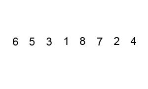

# 一维数组

本讲主要内容：

- 概念引入
- 数组的定义
- 数组的初始化
- 数组的访问
- 循环访问数组
- 数组排序
   - 冒泡排序
   - 选择排序
   - 直接插入排序

## 概念引入

我们来看一下这个例子：

> 存储全班同学的成绩，并算出总成绩与平均分。（全班50人）

如果没有数组，那么需要初始化50个变量：

```c
int score1 = 0;
int score2 = 0;
int score3 = 0;
...
...
...

int sum = score1 + score2 + ... + score50;
int avg = sum / 50;

```

不难看出，我们不可能去初始化50个变量，那么有没有更好的解决办法呢？

当然有，**数组！**

## 数组的定义

基本概念：

- 在定义数组时，计算机会分配<font color=red>一块连续的空间</font>
- 定义方式为：`类型 数组名[数组长度];`
- 命名规则与变量命名规则相同（首字母小写、驼峰法）
- 数组长度定义后，就不能改变
- Clang编译环境下，长度可以是变量。但是数组取的值，是定义数组时，变量的值。

具体写法为：

```c
int scores[50]; // 含义：定义一个长度为50的数组scores
```
## 数组的初始化

在变量定义时给值，叫做初始化。

### 将全部值都初始化为0

```c
int scores[50] = {};

// 或

int scores[50] = {0};
```

### 初始化部分或全部的值

初始化全部的数据。需要注意的是：

- 现在的数组长度为3，所以最多只能给3个值
- 数组类型为`int`，所以数组中只能放`int`类型的值

```c
int scores[3] = {94, 91, 80};
```
下面的例子中，数组长度为50。如果只初始化2个值，那么剩下的48个值，均为0。

```c
int scores[50] = {94, 90};
```

### 已确定个数的初始化方式

当数组长度已经确定时，可以省略数组长度，直接初始化。

```c
int score[] = {34, 78, 64};
```

## 数组的读写

### 访问某个值

访问时需要注意以下几点：

- 数组通过下标访问
- 下标从0开始（意味着长度为40的数组，下标范围是0~39）
- 注意不要越界（超出访问范围）

```c
int scores[50] = {30, 58, 93, 80, 32, 45};

int firstScore = scores[0]; // 访问第0个数
int thirdScore = scores[2]; // 访问第3个数
```

### 赋值

```c
int scores[50] = {0}; // 定义并初始化数组

scores[0] = 10; // 第0个值为10
scores[3] = 90; // 第3个值为90
```

## 循环访问数组

有了数组，不仅方便了同类变量的定义，最重要的是，数组的下标是连续的，我们可以通过循环的方式，来访问数组。

来看下面这个例子：

> 定义一个长度为6的成绩数组，并初始化。求出总分与平均分。

```c
#include <stdio.h>

int main(int argc, const char * argv[]) {
    // insert code here...
    
    int scores[6] = {1, 3, 4, 6, 2, 4};
    int sum = 0;
    
    for (int i = 0; i < 6; i ++) {
        
        sum += scores[i];
    }
    
    printf("总分 = %d, 平均分 = %lf", sum, sum / 6.0);
    
    return 0;
}
```

练习：

> 录入6个成绩，求出总分与平均分。

## 数组的排序

排序一直是数组操作中，最经典的话题。各种算法，各种实现方式，最后还有各种面试，防不胜防的会问到。这一讲介绍到的数组排序方式都比较基础：

- 冒泡排序
- 选择排序
- 直接插入排序

### 冒泡排序

步骤：每次将最大的数冒出来。（每一轮都会将最大值排到最前或最后）

思路：比较两个相邻两个数，如果`i > i + 1`，则交换位置。每轮排序完成后，减少起点（或重点），避免重复比较有序部分。



```c
// 冒泡排序
void bubbleSort() {
    
    int array[5] = {1, 2, 3, 5, 4};
    int sum = 0; // 记录执行次数
    
    for (int i = 0; i < 5; i ++) {
        
        int flag = 0; // 标记是否提前完成排序
        
        for (int j = 0; j < 5 - i - 1; j ++) {
            
            if (array[j] > array[j + 1]) {
                
                flag = 1; // 如果该轮排序进行了值的交换，说明排序还未完成
                
                int temp = array[j];
                array[j] = array[j + 1];
                array[j + 1] = temp;
            }
            sum ++; // 排序字数++
        }
        if (flag == 0) {
            
            break;
        }
    }
    
    printf("排序共执行%d次\n", sum);
    
    // 遍历输出
    for (int i = 0; i < 5; i ++) {
        
        printf("%d ", array[i]);
    }
}

```

### 选择排序

步骤：遍历数组，每一轮找到最大的值，与最前（最后）交换。

实现：

```c
void selectionSort() {
    
    int array[7] = {4, 6, 3, 1, 7, 5, 2};
    
    // 每一轮循环，找出第i大的数，放到第i位
    for (int i = 0; i < 7; i ++) {
        
        // 默认最小值的下标为i
        int minIndex = i;
        
        // 循环找最小值，j从i开始，避免重复查找
        for (int j = i + 1; j < 7; j ++) {
            
            if (array[j] < array[minIndex]) {
                
                minIndex = j;
            }
        }
        // 将找到的最小值，与第i位互换
        int temp = array[i];
        array[i] = array[minIndex];
        array[minIndex] = temp;
    }
    // 遍历输出
    for (int i = 0; i < 7; i ++) {
        
        printf("%d ", array[i]);
    }
}
```

### 插入排序

步骤：找到一个数的正确位置，插入数组。

思路：


```c
void insertionSort() {
    
    int array[8] = {6, 5, 3, 1, 8, 7, 2, 4};
    
    // 每一轮循环，可保证第i个数之前是有序的
    for (int i = 1; i < 8; i ++) {
        
        int j = i;
        int temp = array[i];
        
        // 第二层循环：移位操作
        for (; j > 0 && temp < array[j - 1]; j --) {
            
            array[j] = array[j - 1];
        }
        array[j] = temp;
    }
    // 遍历输出
    for (int i = 0; i < 8; i ++) {
        
        printf("%d ", array[i]);
    }
}
```